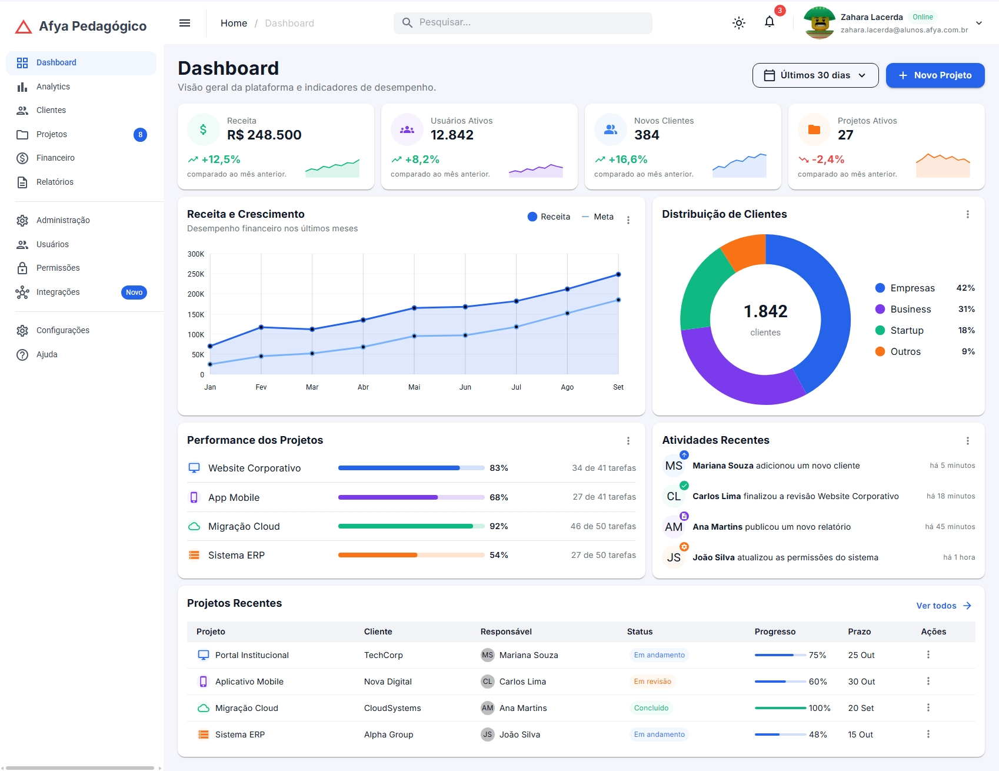
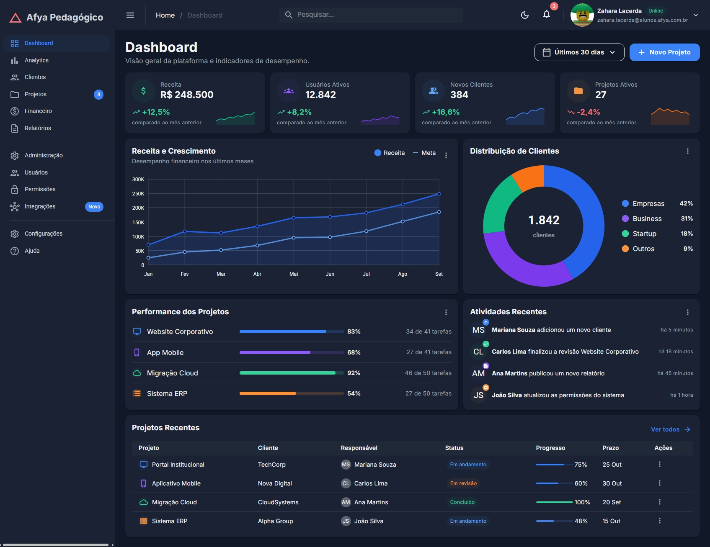
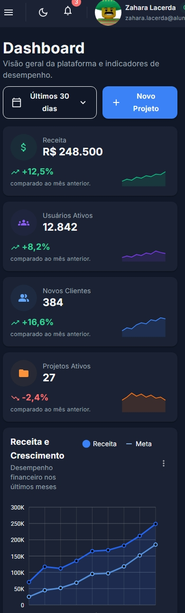
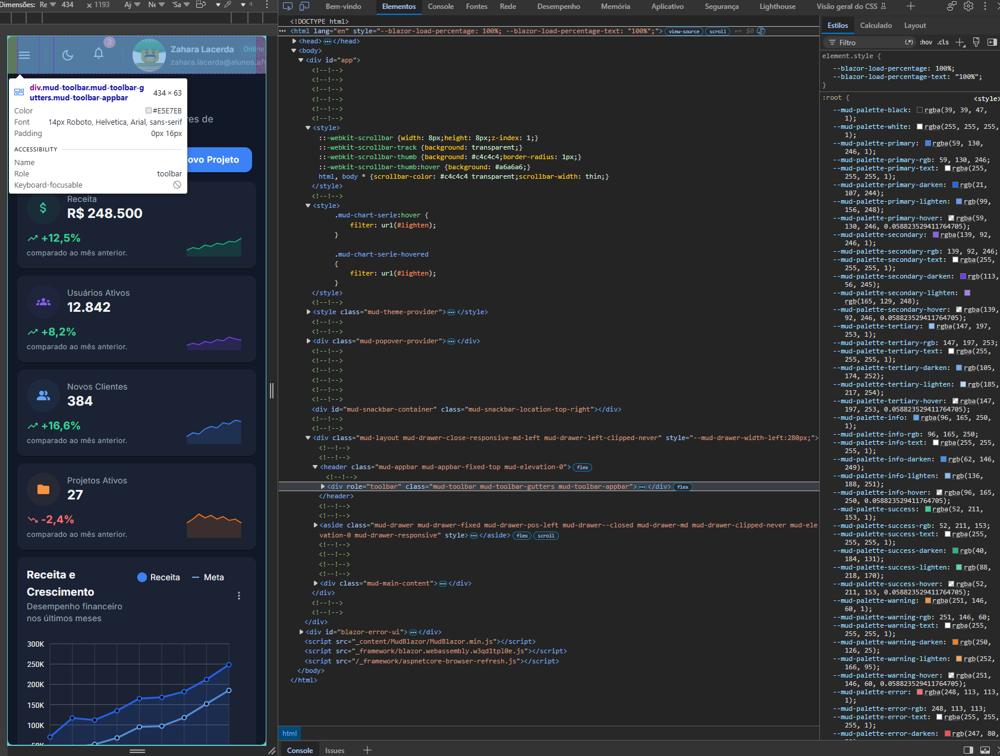

# Afya Admin — Dashboard com Blazor WebAssembly e MudBlazor

## Identificação

| | |
|---|---|
| **Aluno(a)** | Zahara Lacerda |
| **Matrícula** | [2640742] |
| **Faculdade** | Centro Universitário São Lucas-Afya |
| **Curso** | Ciência da Computação |
| **Disciplina** | [Programação Web] |
| **Professor(a)** | [Liluyoud] |
| **Semestre** | 2026.2 |

## Objetivo do projeto

O projeto consiste no desenvolvimento do painel administrativo (dashboard) da plataforma fictícia "Afya Pedagógico". A aplicação centraliza a visualização operacional e estratégica da instituição, permitindo que gestores e coordenadores acompanhem métricas financeiras, retenção de usuários e o andamento de projetos acadêmicos e corporativos em uma interface única.

A tela reúne indicadores de desempenho (KPIs) com minigráficos de tendência (sparklines), gráficos de acompanhamento de receita versus meta e distribuição de segmentos de clientes, além de blocos dedicados à performance de tarefas em equipe, feed em tempo real de atividades recentes e uma listagem tabular dos projetos em execução.

Todo o projeto foi concebido seguindo os princípios de modularidade e separação de responsabilidades do Blazor WebAssembly, exercitando componentização, passagem de parâmetros, renderização responsiva em grid de 12 colunas e alternância dinâmica de tema claro e escuro. Todo o visual foi construído sem nenhuma linha de CSS próprio, aproveitando exclusivamente os componentes, o tema centralizado (`MudTheme`) e as classes utilitárias nativas do MudBlazor.

## Tecnologias utilizadas

- .NET 10 / Blazor WebAssembly (Standalone)
- C# 10+
- MudBlazor 9
- Material Design Icons
- Google Fonts (Inter)

## Como executar

Pré-requisito: [.NET SDK 10](https://dotnet.microsoft.com/) instalado no ambiente.

Clone o repositório e execute a aplicação em modo de observação contínua:

```bash
git clone [https://github.com/zaharadcl/afya-admin.git](https://github.com/zaharadcl/afya-admin.git)
cd afya-admin
dotnet watch

## Telas

### Tema claro


### Tema escuro


### Versão mobile


### HTML gerado (DevTools)
